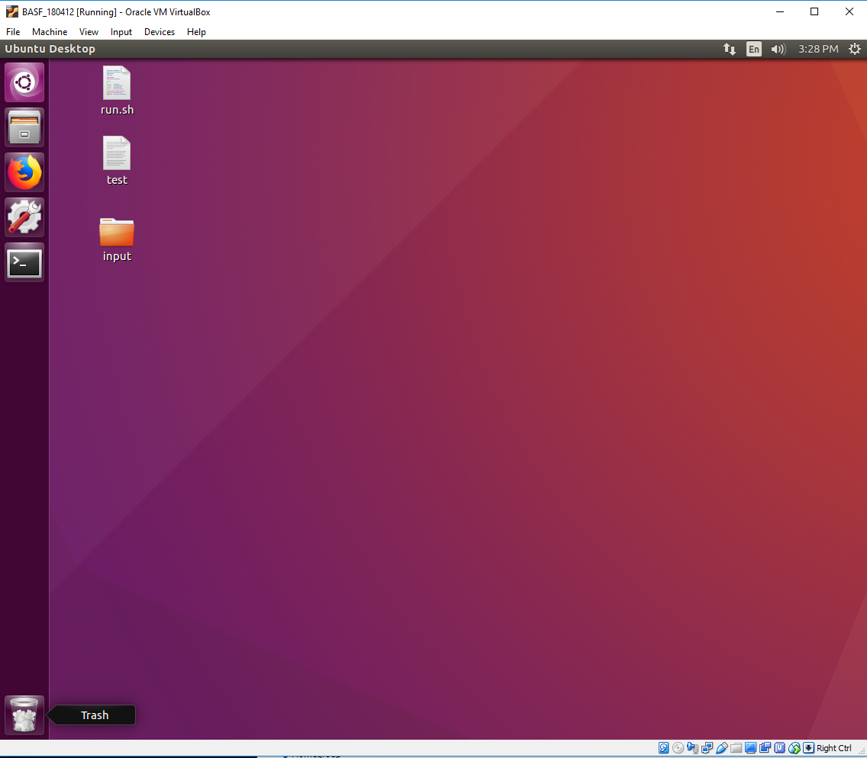

*Jiejun Lu, Hongxiang Qiu, Weidong Xu, Zeyu Zhao*

## Overview and Motivation
BASF is the only mass producer of nematodes used for slug protection, utilizing a plant in Littlehampton, UK equipped with 20 vessels that provide over 190,000 L of fermentation capacity and can hold ~ 38 × 10 ^ 12 nematodes. Product quality is continually tested and maintained through refrigeration and efficient shipping logistics to all our customers, which is a key BASF skill. Using chemical pesticides to protect crops and plants from pests can be controversial because those very pesticides can have detrimental consequences. An alternative to chemical pesticides is to encourage naturally occurring organisms in the soil to destroy pests such as slugs, weevils and caterpillars. Nematodes are naturally occurring microscopic worms already present in the soil that actively seek out and destroy pests. Biologicals for pest control is one of the focus areas within BASF's Agricultural Solutions business. They develop unique formulations of beneficial nematodes and their storage media to provide optimum stability and product performance. The nematodes in the products selectively target problematic insect species, while remaining harmless to beneficial insects (e.g. ladybugs) and nearby wildlife. Finding an efficient way to use nematodes to protect crops could potentially reduce the need to introduce artificial chemicals in to the food supply.

Nematodes have different efficacies at different stages of their life cycles. Automation of identification of whether infective juveniles or not enable efficient quality control. This project applied deep learning techniques to light microscopy image data of nematode populations to determine whether nematodes are at infective juvenile stage or not. We implemented and trained a faster region-based convolutional neural network (faster R-CNN) model for the identification and classification of nematodes from microscope images, and built a software package in a virtual machine image for the automation of nematode classification task.

 
<figure>
    
    <figcaption>
Outline / timeline of the project.
</figcaption>
</figure>
 
<figure>
    
    <figcaption>
Expected input and output.
</figcaption>
</figure>

## Description of Data and EDA
### First batch of data
BASF does not have a digital way to label the nematodes in the microscope images. Initially, we only have some sample microscope images and a slide briefing the characteristics of each life stage of nematodes. A sample image is shown below.
<figure>
    
    <figcaption>
A sample image from the first batch of data.
</figcaption>
</figure>

### Labeling tool
We implemented a labeling tool and delivered it to BASF. BASF used the labeling tool that we provided to generate digital labels of nematodes in microscope images.
<figure>
    
    <figcaption>
Nematodes labeled by our labeling tool.
</figcaption>
</figure>

After that, we continuously received data from BASF. Finally, we have 406 valid labeled microscopy images, with unbalanced distribution as shown below.

<figure>
    
    <figcaption>
Nematode distribution.
</figcaption>
</figure>

### Challenges
We found many challenges for our data analysis and processing.

 
<figure>
    
    <figcaption>
Bad illumination.
</figcaption>
</figure>

 
<figure>
    
    <figcaption>
Noise.
</figcaption>
</figure>

 
<figure>
    
    <figcaption>
Overlapping nematodes.
</figcaption>
</figure>

 
<figure>
    
    <figcaption>
Nematodes with weird shape.
</figcaption>
</figure>

 
<figure>
    
    <figcaption>
Mislabeled data (All nematodes were labeled as "interested" in this image; however, it couldn't be true in this case).
</figcaption>
</figure>

### Data augmentation
Typically, we need ~10,000 samples to train a deep neural network such as faster R-CNN. Considering that we didn't have enough data, we applied aggressive data augmentation. For each original image, we generate its flipped versions and illumination adjusted versions, which grows our training set by 11 times.

## Literature Review / Related Work
Conventional computer vision methods rely on the extraction of feature vectors for the classifier from images or image patches by using the feature descriptor. Histogram of oriented gradients (HOG) is a popular feature descriptor, which uses the distribution of directions of gradients as features [1]. Gradients of an image are large around edges and corners, which carry a lot of information about object shape, and are thus useful for classification. The feature vectors extracted by the HOG descriptor can be fed into a conventional classification algorithm, such as support vector machine (SVM).

 
<figure>
    
    <figcaption>
HOG feature descriptor (source: https://www.learnopencv.com/histogram-of-oriented-gradients/).
</figcaption>
</figure>

Deep learning methods usually outperform conventional methods when there are enough data. Faster R-CNN is the state-of-the-art deep learning algorithm for object detection [2]. The basic idea is first applying convolutional layers to get the feature maps. The region proposal network (RPN) takes different sizes and positions of bounding boxes from the feature map, and learns to classify bounding boxes into background and foreground, as well as learning to refine the bounding boxes. The output of RPN goes through region of interest pooling. It will resize the proposed bounding boxes into same shape, and the classifier will predict the class of each bounding box.

 
<figure>
    
    <figcaption>
Faster R-CNN (source: https://arxiv.org/pdf/1506.01497.pdf).
</figcaption>
</figure>

## Modeling Approach
### Baseline models
From a machine learning point of view, the problem could be divided into two parts: detection and classification. Detection is to find the individual nematodes in the microscope image. Classification is to predict whether the nematodes is in interested stage.

The steps of our baseline model is as follows:
1. Extract images of individual nematodes from a microscope image. Our segmentation uses conventional computer vision techniques. We set area threshold and average color threshold to distinguish large noise contours from nematodes.
2. Apply HOG feature extraction algorithm to obtain feature vectors for extracted nematodes.
3. Feed the feature vectors to a simple classifier, such as support vector machine or random forest.
4. Count the number of interested nematodes in each microscope image.

 
<figure>
    
    <figcaption>
Baseline models pipeline.
</figcaption>
</figure>

### Deep neural networks
Our baseline models can not handle the situation of overlapped nematodes effectively. And deep learning models usually outperform conventional methods when there are enough data. We applied an end-to-end faster R-CNN model for nematode detection and classification.

We applied a pre-trained res152 network to get the feature maps. The region proposal network (RPN) takes different sizes and positions of bounding boxes from the feature map, and learns to classify bounding boxes into background and foreground; it also learns to refine the bounding boxes. The output of RPN goes through region of interest (RoI) pooling. It resizes the proposed bounding boxes into same shape, and the classifier will predict the class of each bounding box.

 
<figure>
    
    <figcaption>
Faster R-CNN.
</figcaption>
</figure>

The size of bounding boxes are not explicitly considered when we do classification, since RoI layer resizes bounding boxes into same dimensions. This makes sense in most applications because objects appear smaller when they are further away, when we do object detection in such cases size of bounding boxes shouldn’t be considered. However, in microscope images the distance to camera is fixed. And when we classify nematodes, size matters. Nematodes that are either too small or too big are unlikely to be interested. To take the size information into account, we implemented a modified version of faster R-CNN, which we call scale aware R-CNN (SA-R-CNN). We get the size information from RPN, which is fed into the classifier together with the results of RoI pooling.

 
<figure>
    
    <figcaption>
SA-R-CNN.
</figcaption>
</figure>

As we mentioned ealier, we applied aggressive data augmentation, which grows our training set by 11 times, since we didn't have enough data. Our implementation is adapted from an open source implementation of faster R-CNN, which uses VOC dataset. We built the dataset into VOC format for training and prediction.

## Results and Discussion
### Model performance

We recieved 4 batches of data, which contained 406 labeled images in total. We trained our models on the first 3 batches and evaluated on the last batch (42 images).

The classification results are summarized below (AUC/accuracy is evaluated by matching each box predicted to each box labeled and ignoring those don’t match):

 | AUC | Accuracy
--- | --- | ---
SVM | 0.66 | 0.75
Random Forest | 0.69 | 0.75
Faster R-CNN (res152) | 0.82 | 0.74
**SA-R-CNN (res152)** | **0.88** | **0.75**

The bounding box detection error for SA-R_CNN is summarized below:

 | Actual label | No Actual Label
--- | --- | ---
Predicted Label | 42 | 78 (only 1 infective)
No Predicted Label | 0 | N/A

From the results, we see our SA-R-CNN is better than the default faster R-CNN and both of them are better than conventional models (since conventional models are worse on detection, the statistics shown for conventional models are higher than the actual values). For detection, our SA-R-CNN predicts many nematode-like objects such as dead nematodes. However, since almost all those predictions are non-infective, we think it’s not an issue (dead nematodes are not infective anyway).

As discussed, we think our models are not trained enough due to the lack of training data. With more data, we believe our models can do better.

### Software deployment

We built a software that automatically output the predictions for each image.

 
<figure>
    
    <figcaption>
An example output image by our software.
</figcaption>
</figure>

We delivered a virtual machine with all models and GUI to BASF.

 
<figure>
    
    <figcaption>
Virtual machine.
</figcaption>
</figure>

 
<figure>
    
    <figcaption>
GUI (export counts, update, etc.).
</figcaption>
</figure>

The source code of our models can be found here: https://github.com/BASFProject-2018spring

The VM can be downloaded from our Google Drive:  https://drive.google.com/file/d/1-VdYoSuK8tQ_kuPHHLNH-PFjvQa4caqY/view?usp=sharing

The video tutorial can be found here: https://youtu.be/2c5iCQSVKvE

## Conclusions and Future Work

We have implemented a deep learning method, faster R-CNN, and have created a new network architecture to make R-CNN model sacle aware, for nematode classification. Our deep learning models outperform baseline models, although our models suffer from overfitting due to the unavailability of enough training data. Also, we have delivered our models and GUI within a virtual machine to BASF.

Our models can be improved in the following aspects:
1. Deep learning models typically require hugh amount of training data. We believe our model can perform better with more data.
2. Currently our models assume the input images are at a fixed scale. We should be able to handle images at different scales in the future.
3. More efforts are required to improve the interpretability of our models.